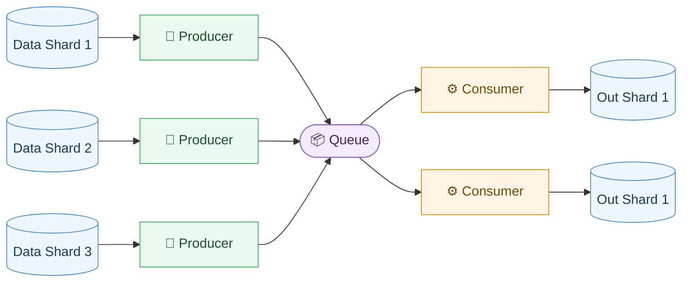

# 🏗️ Hyped Crane


[](https://github.com/open-hyped/crane/actions/workflows/tests.yml)
[](https://github.com/open-hyped/crane/actions/workflows/linting.yml)
[](https://coveralls.io/github/open-hyped/crane?branch=main)
[](https://pypi.org/project/hyped-crane)
[](https://pypi.org/project/hyped-crane/)

Lift (process) and place (write) data streams, seamlessly and in parallel.

Hyped Crane is a Python library designed to simplify working with HuggingFace `datasets`' iterable datasets. It provides powerful tools for applying transformations to data streams, handling parallel processing, and writing data in varios formats.


## Features

- **Streaming-Friendly Transformations**: Apply lazy, streaming-friendly transformations to iterable datasets without preloading data into memory.
- **Seamless Multiprocessing**: Effortlessly process and write datasets using multiple processes, improving performance on large datasets.
- **Easily Extendable**: Provides a straightforward interface to implement support for custom data formats.
- **Interoperability with Hugging Face Datasets**: Write datasets in formats directly loadable using HuggingFace’s `load_from_disk` function.

## Installation

To install the library from **PyPI**, run:

```bash
pip install hyped-crane
```

To install the library **from source**, clone run:

```bash
git clone https://github.com/open-hyped/crane.git
cd crane
pip install .
```

## Getting Started

Here’s a quick example to illustrate how Hyped Crane works

### Step 1: "Load" the Dataset

`crane` is designed to work seamlessly with HuggingFace’s iterable datasets. Let’s start by creating one:

```python
import datasets

# Create a dummy iterable dataset
dummy_data = [
    {"a": 0, "b": [1, 2, 3, 4]},
    {"a": 1, "b": [5, 6]},
    {"a": 1, "b": [7, 8, 9, 10]}
]
ds = datasets.Dataset.from_list(dummy_data)
ds = ds.to_iterable_dataset()
```

### Step 2: Apply a Lazy Transformation

Transformations on iterable datasets are applied lazily. That means the data isn’t processed until it’s actually read:

```python
# Apply a transformation to compute the maximum of list "b"
features = datasets.Features(ds.features | {"max(b)": ds.features["b"].feature})
ds = ds.map(lambda x: {"max(b)": max(x["b"])}, features=features)
```

**Note**: Some writers, including the `ArrowDatasetWriter`, require the dataset features to be well defined.

### Step 3: Write the Dataset to Disk

Use `crane`’s `ArrowDatasetWriter` to save the transformed dataset to disk. You can enable multiprocessing to speed up the transformation and writing processes:

```python
from crane import ArrowDatasetWriter

# Write the transformed dataset to disk with multiprocessing
writer = ArrowDatasetWriter("data", overwrite=True, num_proc=3)
writer.write(ds)
```

**Key Benefits**:
- **Data-Parallel Transformations**: The transformations defined by `map` operations are moved into the workers, allowing transformation workload to be evenly distributed.
- **Efficient Writing**: Each worker writes its own shard to disk in parallel, reducing bottlenecks in **I/O operations**.

`crane` handles worker communication, task distribution, and writing operations, so you can focus on defining your transformation logic without worrying about parallelization details.

**Note**: Datasets saved with the `ArrowDatasetWriter` are fully compatible with HuggingFace’s `load_from_disk` function. You can reload the dataset and continue working with it:

```python
# Reload the dataset from disk
ds = datasets.load_from_disk("data")
```

## How Multiprocessing Works

HuggingFace iterable datasets expose a fixed number of *shards* (`ds.n_shards`). The naive way to parallelize is to hand one shard to each worker, but that caps parallelism at the number of shards, leaves extra cores idle, and stalls whenever shards are uneven in size. `crane` avoids this with a **dynamic runner** that assigns work in two stages depending on how many workers there are relative to shards.

### Stage 1: one worker per shard

While shards remain unassigned, every idle worker claims a whole shard and processes it end-to-end (read → transform → write) on its own. There is no cross-worker communication, so overhead is minimal. When `num_workers ≤ num_shards`, this alone keeps every worker busy.

### Stage 2: multiple workers per shard

Once all shards are assigned but workers are still free, either because `num_workers > num_shards`, or because some workers finished their shard while others are still busy, idle workers join an already in-progress shard instead of sitting idle. The workers on that shard split into two roles connected by a shared queue:

- **Producers** read raw batches from the shard and push them onto the queue.
- **Consumers** pull batches off the queue and run the transform and write steps.



This lets more than one worker collaborate on a single shard, so a shard can be drained by as much compute as is available. All producers feed the **same** central queue, and any consumer can pull the next batch from it, decoupling how fast data is read from how fast it is transformed and written.

Crucially, the split between producers and consumers is **not fixed**. `crane` aims to dynamically shift workers between the two roles according to queue utilization to maximize throughput:

- If the queue is **full**, producers are running ahead and end up stalling, the bottleneck is downstream, so a worker is better spent as a consumer.
- If the queue is **empty**, consumers are starved and sit idle, the bottleneck is upstream, so a worker is better spent as a producer.

A **balancer** continuously watches the queue's fill level and the time producers and consumers spend blocked, and shifts workers between the two roles to keep the two sides matched, searching for the sweet spot where neither side is left waiting and total throughput is maximized.

## Contributions

Contributions are welcome! Feel free to submit a pull request or open an issue to discuss your ideas.
